---
## Front matter
title: "Отчёт по лабораторной работе 1"
author: "Ду нашсименту Висенте Феликс"

## Generic otions
lang: ru-RU
toc-title: "Содержание"

## Bibliography
bibliography: bib/cite.bib
csl: pandoc/csl/gost-r-7-0-5-2008-numeric.csl

## Pdf output format
toc: true # Table of contents
toc-depth: 2
lof: true # List of figures
lot: true # List of tables
fontsize: 12pt
linestretch: 1.5
papersize: a4
documentclass: scrreprt
## I18n polyglossia
polyglossia-lang:
  name: russian
  options:
	
	- babelshorthands=true
polyglossia-otherlangs:
  name: english
## I18n babel
babel-lang: russian
babel-otherlangs: english
## Fonts
mainfont: PT Serif
romanfont: PT Serif
sansfont: PT Sans
monofont: PT Mono
mainfontoptions: Ligatures=TeX
romanfontoptions: Ligatures=TeX
sansfontoptions: Ligatures=TeX,Scale=MatchLowercase
monofontoptions: Scale=MatchLowercase,Scale=0.9
## Biblatex
biblatex: true
biblio-style: "gost-numeric"
biblatexoptions:
  - parentracker=true
  - backend=biber
  - hyperref=auto
  - language=auto
  - autolang=other*
  - citestyle=gost-numeric
## Pandoc-crossref LaTeX customization
figureTitle: "Рис."
tableTitle: "Таблица"
listingTitle: "Листинг"
lofTitle: "Список иллюстраций"
lotTitle: "Список таблиц"
lolTitle: "Листинги"
## Misc options
indent: true
header-includes:
  - \usepackage{indentfirst}
  - \usepackage{float} # keep figures where there are in the text
  - \floatplacement{figure}{H} # keep figures where there are in the text
---

## Цель работы

 Установка и конфигурация операционной системы на виртуальную машину

## 1.2. Указания к работе

### 1.2.1. Техническое обеспечение

Лабораторная работа подразумевает установку на виртуальную машину
VirtualBox (<https://www.virtualbox.org/>) операционной системы Linux
(дистрибутив Rocky (<https://rockylinux.org/>) .
С помощью официального сайта "Rocky linux" я скачал загрузочную версию x86_64.

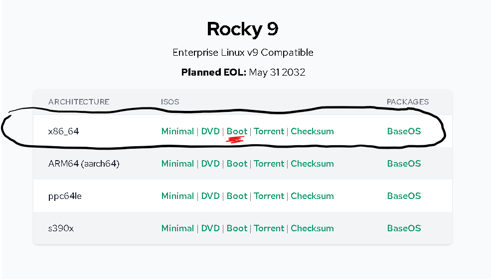

## 1.3. Последовательность выполнения работы

Создайте новую виртуальную машину. Для этого в VirtualBox выберите
Машина Создать .
Укажите имя виртуальной машины (ваш логин в дисплейном классе), тип
операционной системы — Linux, RedHat (рис. 1.2).
Укажите размер основной памяти виртуальной машины (рис. 1.3) — 2048
МБ (или большее число, кратное 1024 МБ, если позволяют технические характеристики вашего компьютера).
Задайте конфигурацию жёсткого диска — загрузочный,VDI (BirtualBox Disk
Image), динамический виртуальный диск (рис. 1.4–1.6).
Задайте размер диска — 40 ГБ (или больше), его расположение — в данном
случае /var/tmp/имя_пользователя/имя_пользователя.vdi (рис. 1.7).
Выберите в VirtualBox для Вашей виртуальной машины Настройки
Носители . Добавьте новый привод оптических дисков и выберите образ
операционной системы, например для работающих в дисплейных классах
/afs/dk.sci.pfu.edu.ru/common/files/iso/Rocky-9.0-x86_64-boot.iso
(рис. 1.8)

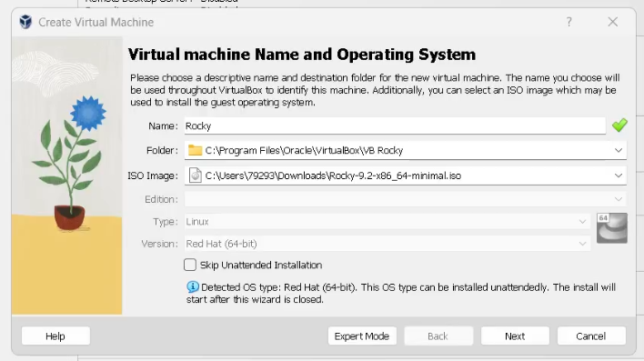

### 1.3.1 установка нежелательной гостевой ОС

Вы можете настроить автоматическую установку гостевой ОС, изменив имя пользователя, пароль и имя хоста. Кроме того, вы можете включить установку гостевых дополнений. Для пользователей Microsoft Windows можно предоставить ключ продукта.

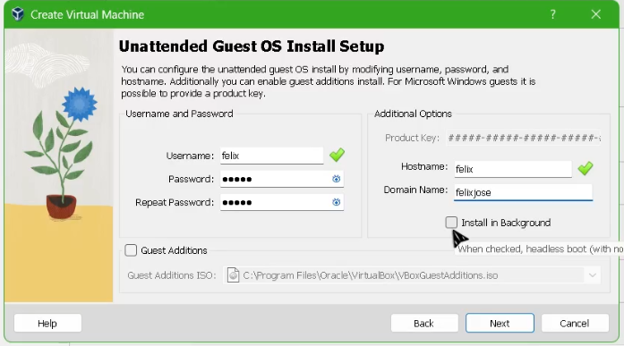

### 1.3.2 Оборудование

Вы можете изменить аппаратное обеспечение виртуальной машины, изменив объем оперативной памяти и количество виртуальных процессоров. Также возможно включение EFI.

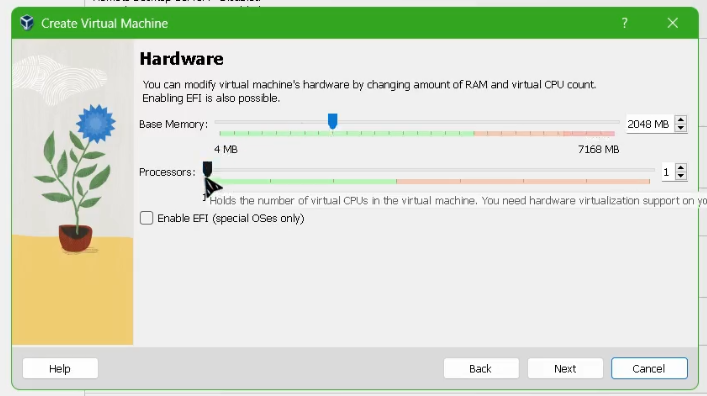

### 1.3.3 Виртуальный жесткий диск

При желании вы можете добавить виртуальный жесткий диск к новому компьютеру. Вы можете либо создать новый файл на жестком диске, либо выбрать существующий. В качестве альтернативы вы можете создать виртуальную машину без виртуального жесткого диска.

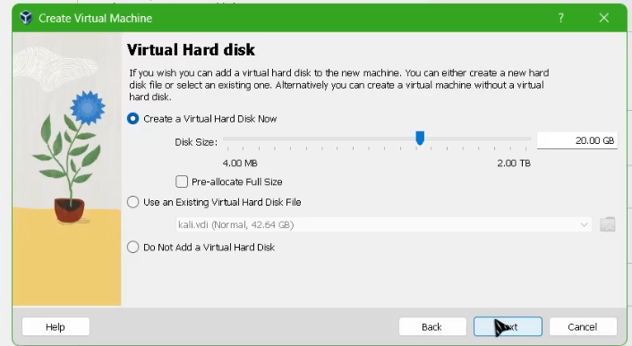

### 1.3.4 Резюме

В следующей таблице приведена краткая информация о конфигурации, которую вы выбрали для новой виртуальной машины. Когда вы будете довольны конфигурацией, нажмите кнопку Готово, чтобы создать виртуальную машину. В качестве альтернативы вы можете вернуться назад и изменить конфигурацию.

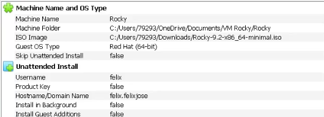
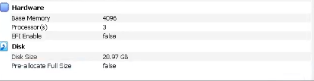

После завершения установки операционной системы корректно перезапустите виртуальную машину и примите условия лицензи

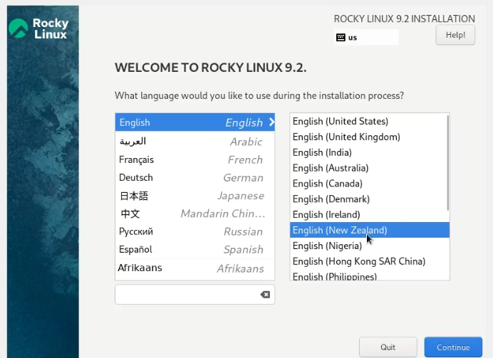

В VirtualBox оптический диск должен отключиться автоматически, но если
это не произошло, то необходимо отключить носитель информации с образом, выбрав Свойства Носители Rocky-версия-dvd1.iso Удалить устройство .
Войдите в ОС под заданной вами при установке учётной записью. В меню
Устройства виртуальной машины подключите образ диска дополнений гостевой ОС , при необходимости введите пароль пользователя
root вашей виртуальной ОС.
После загрузки дополнений нажмите Return или Enter и корректно перезагрузите виртуальную машин

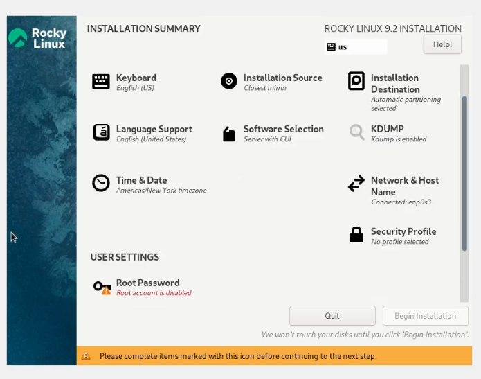
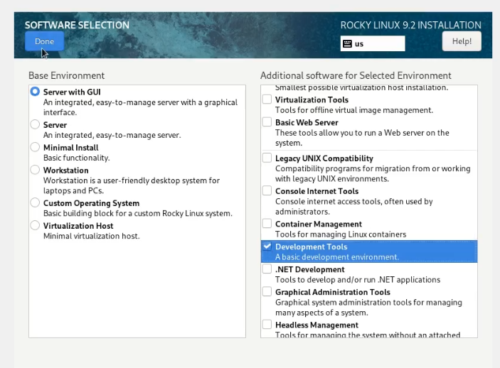

## 1.4.1. Установка имени пользователя и названия хоста

Если при установке виртуальной машины вы задали имя пользователя или
имя хоста, не удовлетворяющее соглашению об именовании (см. раздел 1.2.2),
то вам необходимо исправить это.

1. Запустите виртуальную машину и залогиньтесь.
2. Запустите терминал и получите полномочия администратора
3. Создайте пользователя (вместо username укажите ваш логин в дисплейном классе)
adduser -G wheel username
4. Задайте пароль для пользователя (вместо username укажите ваш логин
в дисплейном классе)
passwd username
5. Установите имя хоста (вместо username укажите ваш логин в дисплейном
классе)
6. Проверьте, что имя хоста установлено верно

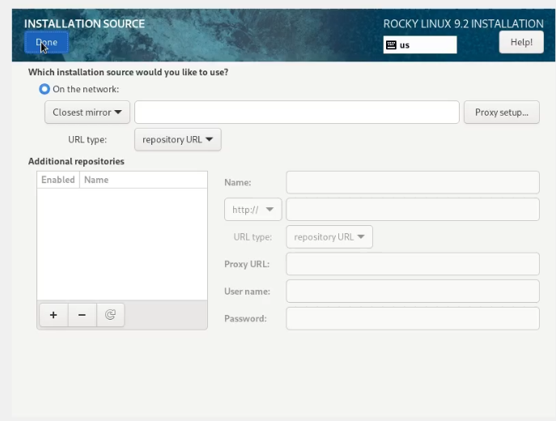
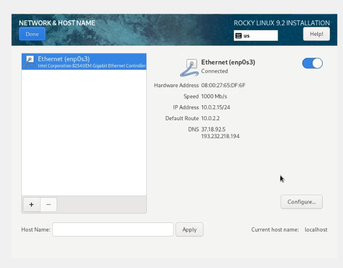
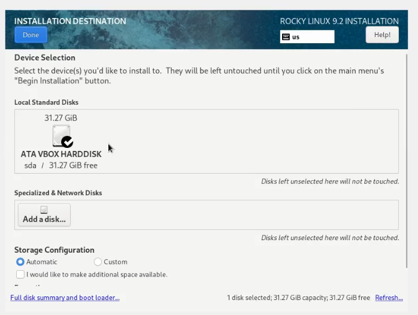
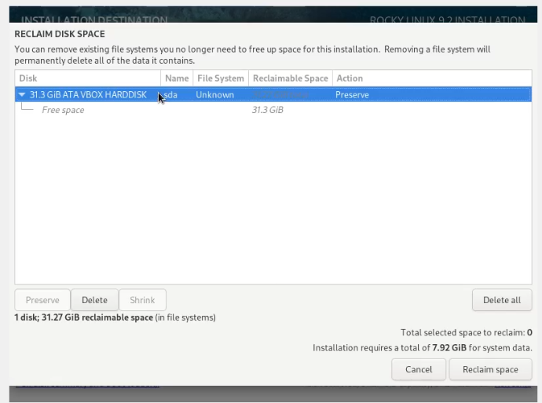
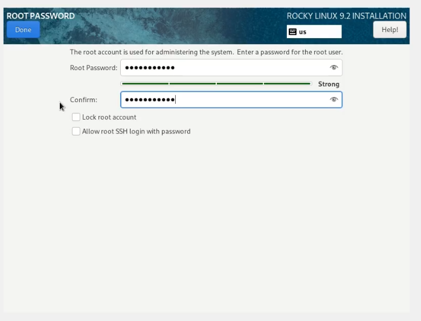
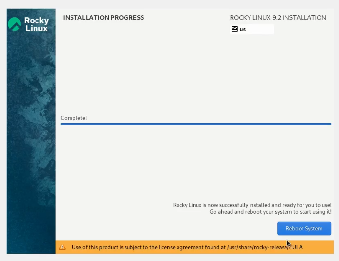
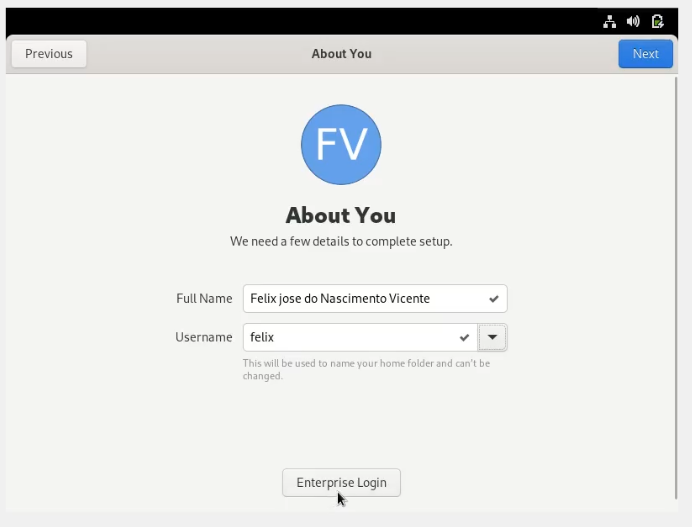
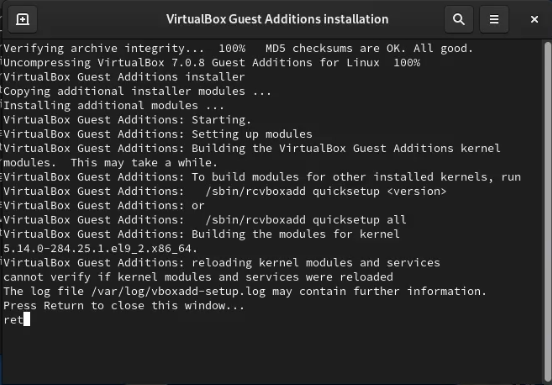

## Выводы

Мы установили и настроили систему, которую будем использовать во время дисциплины, и узнали, как установить операционную систему Rocky linux 9
