---
## Front matter
title: "Отчёт по лабораторной работе 2"
author: "Ду нашсименту Висенте Феликс"

## Generic otions
lang: ru-RU
toc-title: "Содержание"

## Bibliography
bibliography: bib/cite.bib
csl: pandoc/csl/gost-r-7-0-5-2008-numeric.csl

## Pdf output format
toc: true # Table of contents
toc-depth: 2
lof: true # List of figures
lot: true # List of tables
fontsize: 12pt
linestretch: 1.5
papersize: a4
documentclass: scrreprt
## I18n polyglossia
polyglossia-lang:
  name: russian
  options:
	
	- babelshorthands=true
polyglossia-otherlangs:
  name: english
## I18n babel
babel-lang: russian
babel-otherlangs: english
## Fonts
mainfont: PT Serif
romanfont: PT Serif
sansfont: PT Sans
monofont: PT Mono
mainfontoptions: Ligatures=TeX
romanfontoptions: Ligatures=TeX
sansfontoptions: Ligatures=TeX,Scale=MatchLowercase
monofontoptions: Scale=MatchLowercase,Scale=0.9
## Biblatex
biblatex: true
biblio-style: "gost-numeric"
biblatexoptions:
  - parentracker=true
  - backend=biber
  - hyperref=auto
  - language=auto
  - autolang=other*
  - citestyle=gost-numeric
## Pandoc-crossref LaTeX customization
figureTitle: "Рис."
tableTitle: "Таблица"
listingTitle: "Листинг"
lofTitle: "Список иллюстраций"
lotTitle: "Список таблиц"
lolTitle: "Листинги"
## Misc options
indent: true
header-includes:
  - \usepackage{indentfirst}
  - \usepackage{float} # keep figures where there are in the text
  - \floatplacement{figure}{H} # keep figures where there are in the text
---

## 2.1 Цель работы

 Получение практических навыков работы в консоли с атрибутами файлов, закрепление теоретических основ дискреционного разграничения доступа в современных системах с открытым кодом на базе ОС Linux

## 2. Указания к работе

Мы установливали при выполнении предыдущей лабораторной работы
операционной системе создайте учётную запись пользователя guest (использую учётную запись администратора).

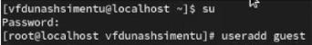

Задавал пароль для пользователя guest (использую учётную запись администратора)

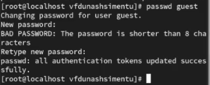

Войду в систему от имени пользователя guest.

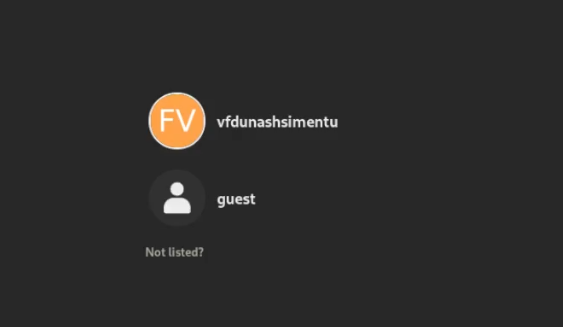

Я определил каталог, в котором нахожусь, с помощью команды pwd. Я сравнил его с командной строкой. Я определил, что она
мой домашний каталог.

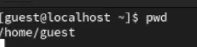

Я Уточнил имя моего пользователя командой whoami.

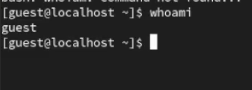

Уточнил имя моего пользователя, его группу, а также группы, куда входит пользователь, командой id. Выведенные значения uid, gid и др. запомните. Сравните вывод id с выводом команды groups.

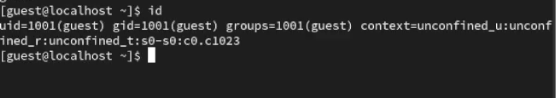

Сравнивал полученную информацию об имени пользователя с данными,
выводимыми в приглашении командной строки.
и я мог заметить, что имя было таким же.

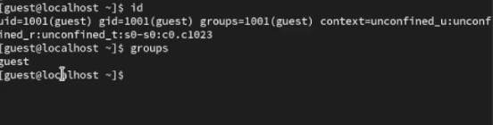

Я видел файл / etc / passwd с командой
cat / etc / passwd
Я нашел свой счет. Я определил uid пользователя.
Я определил gid пользователя. Появился пользователь vfdunashsimentu

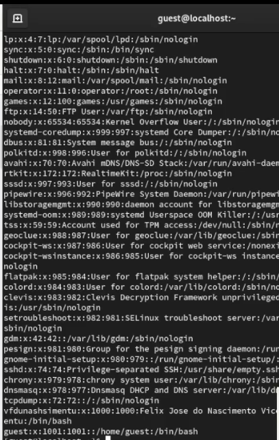

Я определил существующие каталоги в системе с помощью команды
ls-l / home/
и мне удалось получить список подкаталогов каталога / home

Итак, drwx------ означает, что это каталог, и только владелец этого каталога имеет права на чтение, запись и доступ к его содержимому, а остальные пользователи не имеют никаких прав доступа к нему.

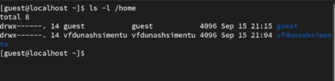

Я проверил, какие расширенные атрибуты установлены в подкаталогах, расположенных в каталоге / home, с помощью команды:
lsattr / home
Но я не мог видеть ни расширенные атрибуты каталога, ни расширенные атрибуты каталог других пользователей.

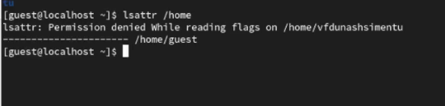

Я создал подкаталог dir1 в домашнем каталоге с помощью команды
mkdir dir1.
Я определил с помощью команд ls-l и lsattr, какие разрешения и атрибуты расширения были установлены для каталога dir1, и я снял все атрибуты каталога dir1 с помощью команды chmod 000 dir1 и убедитесь, что команда выполнена правильно ls-l.

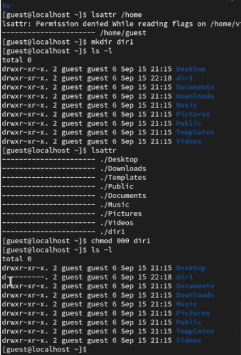

Я попытался создать файл file1 в каталоге dir1 с помощью команды
echo "test" > / home / guest / dir1 / file1
Но операция создания файлов была отклонена, потому что у меня нет разрешения на открытие или создание файлов в папке .
Я проверил с помощью команды
ls-l / home / guest / dir1
файл file1 на самом деле не находится внутри каталога dir1.

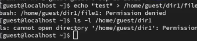

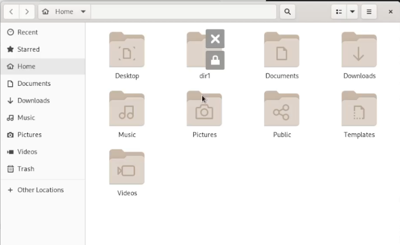

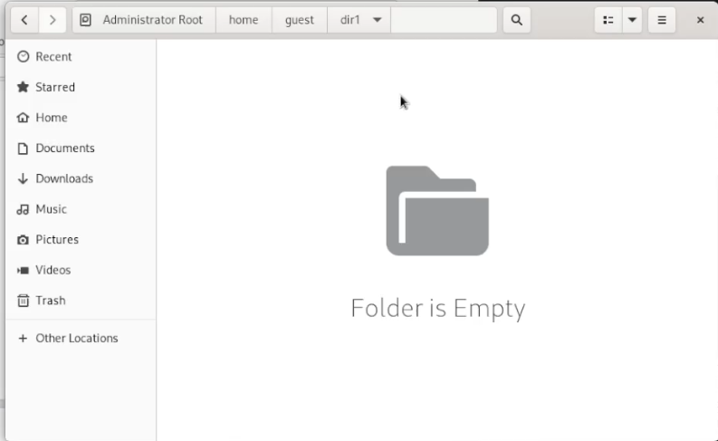

Заполнил таблицу «Установленные права и разрешённые действия»
, выполняя действия от имени владельца директории (файлов), определив опытным путём, какие операции разрешены, а какие нет.
Если операция разрешена, занесло в таблицу знак «+», если не разрешена, знак «-».

drwx------ - это строка, которая представляет собой права доступа к файлу или каталогу в системе Unix или Linux. Давайте разберем ее часть за частью:

Первый символ d указывает на то, что это каталог. Если бы это был файл, он бы начинался с символа -.

Затем идут три набора прав доступа, каждый из которых состоит из трех символов. Эти символы представляют права для владельца файла, группы и остальных пользователей соответственно.

**r** означает право на чтение.
**w** означает право на запись.
**x** означает право на выполнение (для каталогов - право на доступ к содержимому).
В данном случае:

drw означает, что владелец имеет права на чтение, запись и доступ к содержимому каталога.
--- означает, что группа и остальные пользователи не имеют никаких прав доступа к этому каталогу.
(700) означает, что владелец имеет полные права на чтение, запись и выполнение данного файла или каталога, а группа и остальные пользователи не имеют никаких прав доступа к нему.

**(drW______)(600)** указывает, что владелец имеет право на чтение и запись данного файла или каталога, но не имеет права на выполнение. Группа и остальные пользователи не имеют никаких прав доступа к нему.

**(dr_X_____)(500)** указывает, что только владелец имеет право на чтение данного файла или каталога, но не имеет прав на запись или выполнение. Группа и остальные пользователи не имеют никаких прав доступа к нему.
**dr_______(400)** указывает, что только владелец имеет право на чтение данного файла или каталога, но не имеет прав на запись или выполнение. Группа и остальные пользователи не имеют никаких прав доступа к нему. Это наименьший уровень прав доступа, при котором файл может быть прочитан владельцем.
**d_WX_____(300)**:

Для владельца: 3 (право на чтение и запись, так как 2 - право на запись, и 1 - право на чтение, их сумма равна 3).
Для группы: 0 (нет прав доступа).
Для остальных пользователей: 0 (нет прав доступа).

(200):

Для владельца: 2 (право на запись).
Для группы: 0 (нет прав доступа).
Для остальных пользователей: 0 (нет прав доступа).

(100):

Для владельца: 1 (право на чтение).
Для группы: 0 (нет прав доступа).
Для остальных пользователей: 0 (нет прав доступа).

(000):
s
Для владельца: 0 (нет прав доступа).
Для группы: 0 (нет прав доступа).
Для остальных пользователей: 0 (нет прав доступа).

Таким образом, (300) позволяет владельцу читать и записывать файл, а другим пользователям запрещает доступ. (200) позволяет только владельцу записывать файл, а (100) - только читать. (000) полностью запрещает доступ для всех пользователей

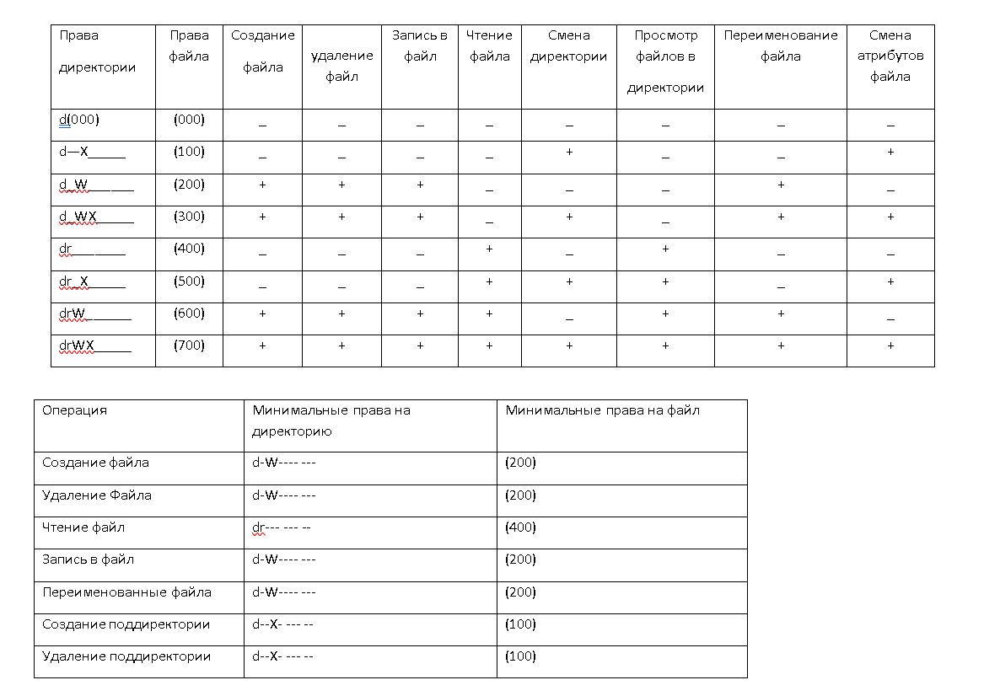

## Выводы

Права доступа могут быть комбинированы, чтобы обеспечить необходимый уровень безопасности и функциональности для файлов и каталогов.

Права доступа влияют на то, кто может просматривать, изменять или выполнять файлы и каталоги, и они играют важную роль в обеспечении безопасности системы.

Регулярная проверка и настройка прав доступа являются важными аспектами управления файлами и каталогами в системе Unix/Linux, чтобы обеспечить безопасность данных и ресурсы