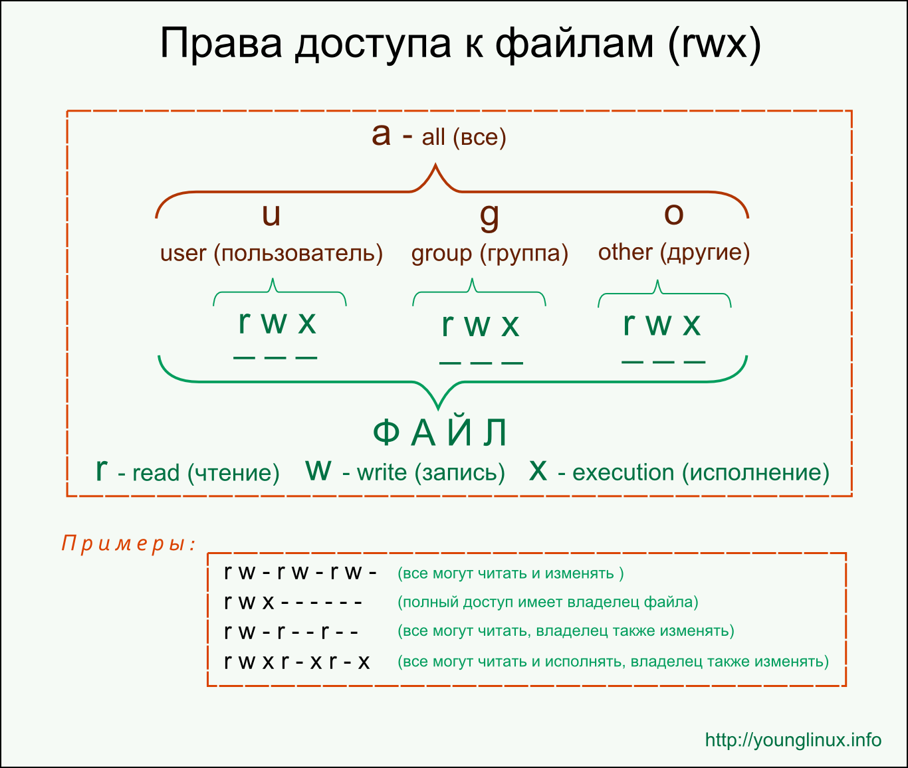

---
## Front matter
lang: ru-RU
title: Лабораторная работа №3
subtitle: Информационная безопасность
author:
  - Ду Нашсименту В.Ф.ж.
institute:
  - Российский университет дружбы народов, Москва, Россия
date: 24 февраля 2022

## i18n babel
babel-lang: russian
babel-otherlangs: english

## Formatting pdf
toc: false
toc-title: Содержание
slide_level: 2
aspectratio: 169
section-titles: true
theme: metropolis
header-includes:
 - \metroset{progressbar=frametitle,sectionpage=progressbar,numbering=fraction}
 - '\makeatletter'
 - '\beamer@ignorenonframefalse'
 - '\makeatother'
 - \usepackage{amsmath}
---

## Докладчик

:::::::::::::: {.columns align=center}
::: {.column width="70%"}

* Ду Нашсименту Висенте феликс Жозе
* студент группы НКНбд-01-20
* Факультет физико-математических и естественных наук
* Российский университет дружбы народов
* <https://github.com/kpatocfelix>

:::
::::::::::::::

## Цель работы

  Получение практических навыков работы в консоли с атрибутами файлов, закрепление теоретических основ дискреционного разграничения доступа в современных системах с открытым кодом на базе ОС Linux

****
## Теоретическое введение

Обычно права доступа разделяются между тремя категориями пользователей:

  1) Владелец (Owner): Это пользователь, который создал файл или директорию. Владелец имеет полный контроль над файлом/директорией и может изменять его права доступа.

  2) Группа (Group): Каждый файл или директория также связана с группой пользователей. Пользователи, входящие в эту группу, могут иметь определенные права доступа к файлу/директории, независимо от других пользователей.

  3) Остальные (Others): Это все остальные пользователи системы, которые не являются владельцем и не состоят в группе, связанной с файлом/директорией.

****
### Выполнение лабораторной работы

****

## Выводы

Права доступа могут быть комбинированы, чтобы обеспечить необходимый уровень безопасности и функциональности для файлов и каталогов.

Права доступа влияют на то, кто может просматривать, изменять или выполнять файлы и каталоги, и они играют важную роль в обеспечении безопасности системы.

Регулярная проверка и настройка прав доступа являются важными аспектами управления файлами и каталогами в системе Unix/Linux, чтобы обеспечить безопасность данных и ресурсы

