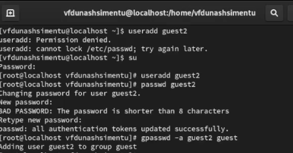
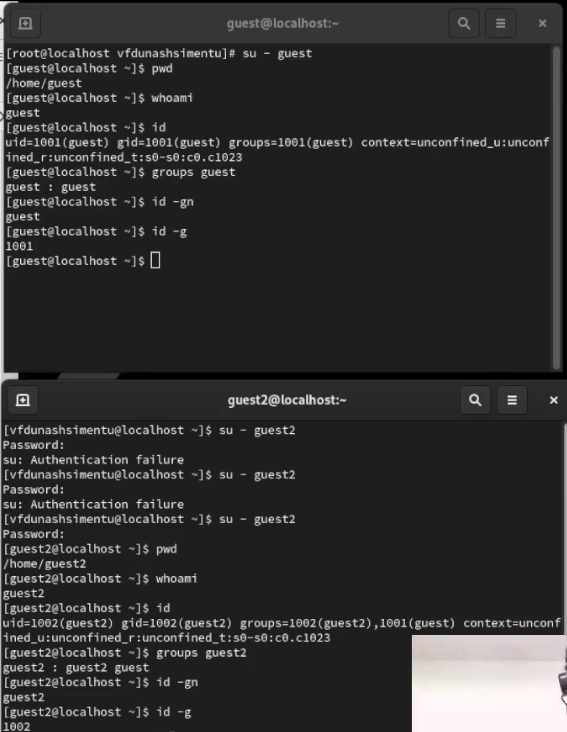
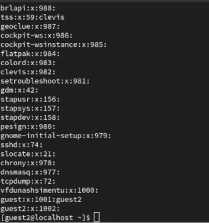
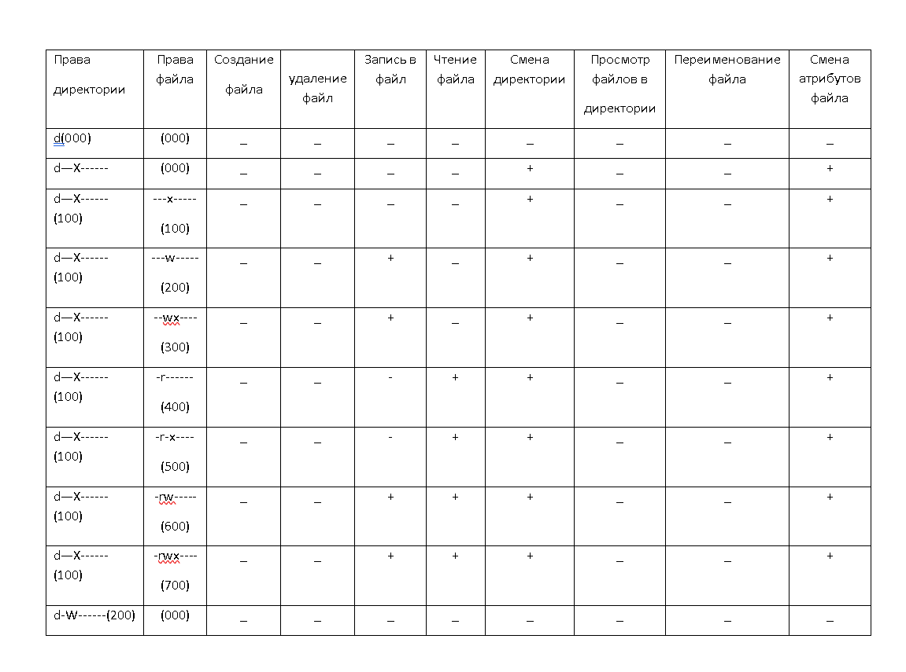
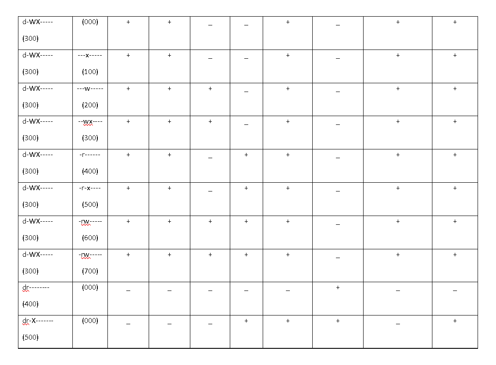
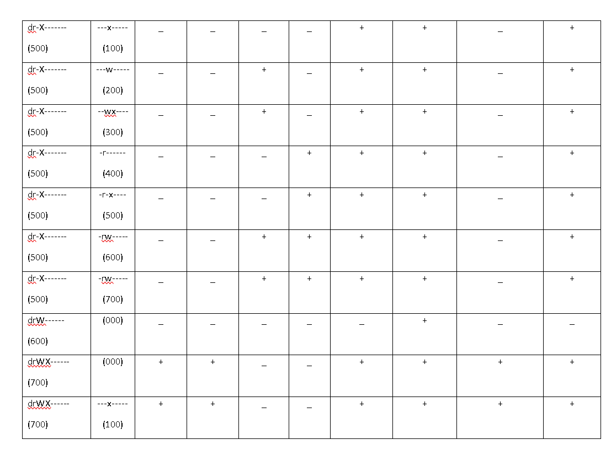
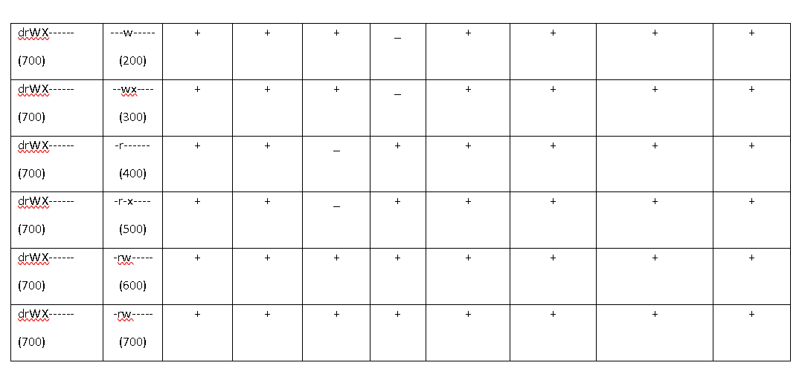
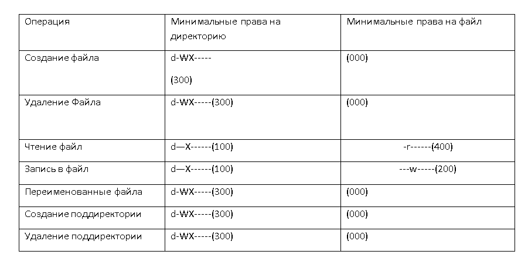

---
## Front matter
title: "Отчёт по лабораторной работе 3"
author: "Ду нашсименту Висенте Феликс"

## Generic otions
lang: ru-RU
toc-title: "Содержание"

## Bibliography
bibliography: bib/cite.bib
csl: pandoc/csl/gost-r-7-0-5-2008-numeric.csl

## Pdf output format
toc: true # Table of contents
toc-depth: 2
lof: true # List of figures
lot: true # List of tables
fontsize: 12pt
linestretch: 1.5
papersize: a4
documentclass: scrreprt
## I18n polyglossia
polyglossia-lang:
  name: russian
  options:
	
	- babelshorthands=true
polyglossia-otherlangs:
  name: english
## I18n babel
babel-lang: russian
babel-otherlangs: english
## Fonts
mainfont: PT Serif
romanfont: PT Serif
sansfont: PT Sans
monofont: PT Mono
mainfontoptions: Ligatures=TeX
romanfontoptions: Ligatures=TeX
sansfontoptions: Ligatures=TeX,Scale=MatchLowercase
monofontoptions: Scale=MatchLowercase,Scale=0.9
## Biblatex
biblatex: true
biblio-style: "gost-numeric"
biblatexoptions:
  - parentracker=true
  - backend=biber
  - hyperref=auto
  - language=auto
  - autolang=other*
  - citestyle=gost-numeric
## Pandoc-crossref LaTeX customization
figureTitle: "Рис."
tableTitle: "Таблица"
listingTitle: "Листинг"
lofTitle: "Список иллюстраций"
lotTitle: "Список таблиц"
lolTitle: "Листинги"
## Misc options
indent: true
header-includes:
  - \usepackage{indentfirst}
  - \usepackage{float} # keep figures where there are in the text
  - \floatplacement{figure}{H} # keep figures where there are in the text
---

## 3.1 Цель работы

 Получение практических навыков работы в консоли с атрибутами файлов для групп пользователей

## 3.2 Порядок выполнения работы

В установленной операционной системе создайте учётную запись пользователя guest (использую учётную запись администратора):
useradd guest
Задайте пароль для пользователя guest (использую учётную запись администратора):
passwd guest
Аналогично создайте второго пользователя guest2.
Добавьте пользователя guest2 в группу guest:
gpasswd -a guest2 guest

Для обоих пользователей командой pwd определите директорию, в которой вы находитесь. Сравните её с приглашениями командной строки.
Уточните имя вашего пользователя, его группу, кто входит в неё
и к каким группам принадлежит он сам. Определите командами
groups guest и groups guest2, в какие группы входят пользователи guest и guest2. Сравните вывод команды groups с выводом команд
id -Gn и id -G.
Сравните полученную информацию с содержимым файла /etc/group.
Просмотрите файл командой
cat /etc/group
От имени пользователя guest2 выполните регистрацию пользователя
guest2 в группе guest командой
newgrp guest

От имени пользователя guest измените права директории /home/guest, разрешив все действия для пользователей группы:
chmod g+rwx /home/guest

От имени пользователя guest снимите с директории /home/guest/dir1 все атрибуты командой chmod 000 dirl

и проверьте правильность снятия атрибутов.
Меняя атрибуты у директории dir1 и файла file1 от имени пользователя guest и делая проверку от пользователя guest2, заполните табл. 3.1,определив опытным путём, какие операции разрешены, а какие нет. Если операция разрешена, занесите в таблицу знак «+», если не разрешена,знак «-».
Сравните табл. 2.1 (из лабораторной работы № 2) и табл. 3.1.
На основании заполненной таблицы определите те или иные минимально необходимые права для выполнения пользователем guest2 операций внутри директории dir1 и заполните табл. 3.2

Осуществите вход в систему от двух пользователей на двух р
Заполнил таблицу «Установленные права и разрешённые действия»
, выполняя действия от имени владельца директории (файлов), определив опытным путём, какие операции разрешены, а какие нет.
Если операция разрешена, занесло в таблицу знак «+», если не разрешена, знак «-».

drwx------ - это строка, которая представляет собой права доступа к файлу или каталогу в системе Unix или Linux. Давайте разберем ее часть за частью:

Первый символ d указывает на то, что это каталог. Если бы это был файл, он бы начинался с символа -.

Затем идут три набора прав доступа, каждый из которых состоит из трех символов. Эти символы представляют права для владельца файла, группы и остальных пользователей соответственно.

**r** означает право на чтение.
**w** означает право на запись.
**x** означает право на выполнение (для каталогов - право на доступ к содержимому).
В данном случае:

drw означает, что владелец имеет права на чтение, запись и доступ к содержимому каталога.
--- означает, что группа и остальные пользователи не имеют никаких прав доступа к этому каталогу.
(700) означает, что владелец имеет полные права на чтение, запись и выполнение данного файла или каталога, а группа и остальные пользователи не имеют никаких прав доступа к нему.

**(drW______)(600)** указывает, что владелец имеет право на чтение и запись данного файла или каталога, но не имеет права на выполнение. Группа и остальные пользователи не имеют никаких прав доступа к нему.

**(dr_X_____)(500)** указывает, что только владелец имеет право на чтение данного файла или каталога, но не имеет прав на запись или выполнение. Группа и остальные пользователи не имеют никаких прав доступа к нему.
**dr_______(400)** указывает, что только владелец имеет право на чтение данного файла или каталога, но не имеет прав на запись или выполнение. Группа и остальные пользователи не имеют никаких прав доступа к нему. Это наименьший уровень прав доступа, при котором файл может быть прочитан владельцем.
**d_WX_____(300)**:

Для владельца: 3 (право на чтение и запись, так как 2 - право на запись, и 1 - право на чтение, их сумма равна 3).
Для группы: 0 (нет прав доступа).
Для остальных пользователей: 0 (нет прав доступа).

(200):

Для владельца: 2 (право на запись).
Для группы: 0 (нет прав доступа).
Для остальных пользователей: 0 (нет прав доступа).

(100):

Для владельца: 1 (право на чтение).
Для группы: 0 (нет прав доступа).
Для остальных пользователей: 0 (нет прав доступа).

(000):
s
Для владельца: 0 (нет прав доступа).
Для группы: 0 (нет прав доступа).
Для остальных пользователей: 0 (нет прав доступа).

Таким образом, (300) позволяет владельцу читать и записывать файл, а другим пользователям запрещает доступ. (200) позволяет только владельцу записывать файл, а (100) - только читать. (000) полностью запрещает доступ для всех пользователей

## Выводы

Права доступа могут быть комбинированы, чтобы обеспечить необходимый уровень безопасности и функциональности для файлов и каталогов.

Права доступа влияют на то, кто может просматривать, изменять или выполнять файлы и каталоги, и они играют важную роль в обеспечении безопасности системы.

Регулярная проверка и настройка прав доступа являются важными аспектами управления файлами и каталогами в системе Unix/Linux, чтобы обеспечить безопасность данных и ресурсы.
