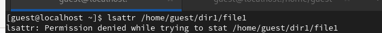
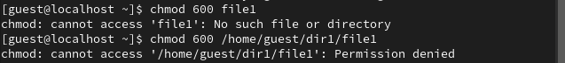
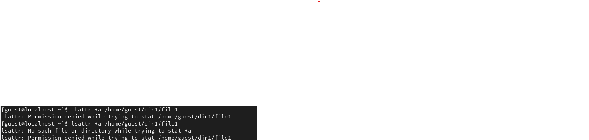
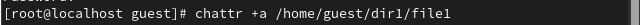
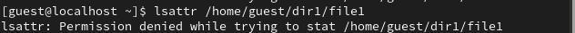
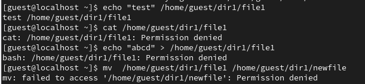
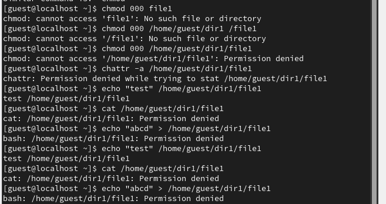
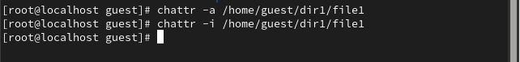

---
## Front matter
lang: ru-RU
title: Лабораторная работа №3
subtitle: Информационная безопасность
author:
  - Ду Нашсименту В.Ф.ж.
institute:
  - Российский университет дружбы народов, Москва, Россия
date: 24 февраля 2022

## i18n babel
babel-lang: russian
babel-otherlangs: english

## Formatting pdf
toc: false
toc-title: Содержание
slide_level: 2
aspectratio: 169
section-titles: true
theme: metropolis
header-includes:
 - \metroset{progressbar=frametitle,sectionpage=progressbar,numbering=fraction}
 - '\makeatletter'
 - '\beamer@ignorenonframefalse'
 - '\makeatother'
 - \usepackage{amsmath}
---

## Докладчик

:::::::::::::: {.columns align=center}
::: {.column width="70%"}

* Ду Нашсименту Висенте феликс Жозе
* студент группы НКНбд-01-20
* Факультет физико-математических и естественных наук
* Российский университет дружбы народов
* <https://github.com/kpatocfelix>

:::
::::::::::::::

## Цель работы

Получение практических навыков работы в консоли с расширенными
атрибутами файлов1.

****

### Выполнение лабораторной работы

****

****

## Выводы

Без разрешений администратора вы не сможете создавать, редактировать, удалять или открывать файл, и это может быть эффективным способом защиты ваших данных