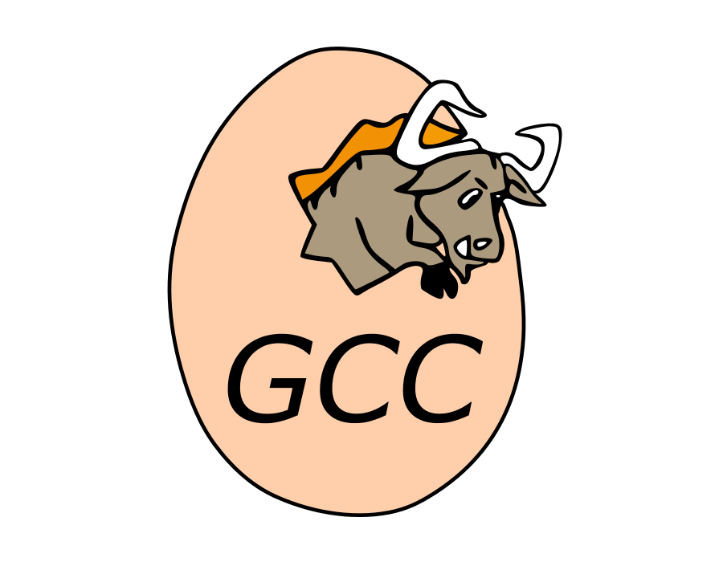
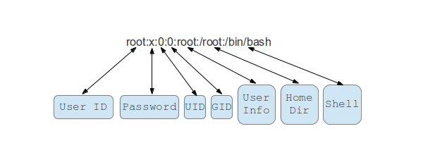
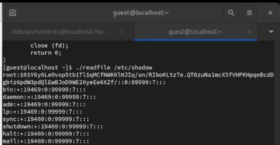

---
## Front matter
lang: ru-RU
title: Лабораторная работа №3
subtitle: Информационная безопасность
author:
  - Ду Нашсименту В.Ф.ж.
institute:
  - Российский университет дружбы народов, Москва, Россия
date: 24.10.2023

## i18n babel
babel-lang: russian
babel-otherlangs: english

## Formatting pdf
toc: false
toc-title: Содержание
slide_level: 2
aspectratio: 169
section-titles: true
theme: metropolis
header-includes:
 - \metroset{progressbar=frametitle,sectionpage=progressbar,numbering=fraction}
 - '\makeatletter'
 - '\beamer@ignorenonframefalse'
 - '\makeatother'
 - \usepackage{amsmath}
---

## Докладчик

:::::::::::::: {.columns align=center}
::: {.column width="70%"}

* Ду Нашсименту Висенте феликс Жозе
* студент группы НКНбд-01-20
* Факультет физико-математических и естественных наук
* Российский университет дружбы народов
* <https://github.com/kpatocfelix>

:::
::::::::::::::

## Цель работы

Изучение механизмов изменения идентификаторов, применения
SetUID- и Sticky-битов. Получение практических навыков работы в консоли с дополнительными атрибутами. Рассмотрение работы механизма смены идентификатора процессов пользователей, а также влияние бита Sticky на запись и удаление файлов

****

### Выполнение лабораторной работы

Механизмы изменения идентификаторов в операционных системах, такие как UID, GID, SetUID, SetGID и Sticky бит, играют важную роль в управлении доступом к ресурсам и обеспечении безопасности. UID определяет пользователя, GID - группу. SetUID позволяет процессам временно получать права владельца файла, SetGID - права группы-владельца. Sticky бит, установленный на директории, предотвращает случайное удаление или перемещение файлов другими пользователями. Понимание и правильное использование этих механизмов важно для обеспечения безопасности системы и данных.

SetUID позволяет процессам временно получать привилегии пользователя-владельца файла, тогда как Sticky-бит предотвращает случайное удаление или перемещение файлов в общих директориях, обеспечивая безопасность и управление доступом.

Операционная система использует уникальные идентификаторы пользователей (UID) и групп (GID) для определения прав доступа к файлам и ресурсам. Каждый файл имеет ассоциированные UID и GID, определяющие владельца файла и его группу. Система проверяет эти идентификаторы при запросах доступа: если UID совпадает с владельцем файла, применяются соответствующие права доступа. Если GID совпадает с группой файла, используются соответствующие правила доступа для этой группы. По этим идентификаторам система определяет, какие действия разрешены для каждого пользователя и группы.

* Парольные программы 
  
* Административные утилиты
* Системные обновления
* Системные резервные копии
SetUID-бит полезен в этих случаях, так как он позволяет программам временно обладать привилегиями, необходимыми для выполнения конкретных задач, обеспечивая при этом безопасность и предотвращая несанкционированный доступ.

## Обзор Sticky-бита и его использования для управления правами доступа к каталогам и файлам в общих директориях

Sticky-бит, установленный на директории, предотвращает случайное удаление или переименование файлов другими пользователями в общих директориях. Он обеспечивает безопасность и управление доступом, позволяя пользователям записывать в общую директорию, но предотвращая изменения или удаление файлов, принадлежащих другим пользователям. Sticky-бит полезен в общедоступных каталогах, таких как временные директории или общие хранилища, где несколько пользователей могут создавать файлы, но должны быть ограничены в возможности изменения или удаления файлов, принадлежащих другим пользователям.

## Понимание, как Sticky-бит предотвращает удаление или переименование файлов другими пользователями

Sticky-бит, установленный на директории, позволяет пользователям создавать, читать и записывать файлы в этой директории. Однако он также предотвращает удаление или переименование файлов, принадлежащих другим пользователям. Это достигается тем, что только владелец файла или суперпользователь может удалить или переименовать файл в директории с установленным Sticky-битом, обеспечивая тем самым безопасность общедоступных директорий, где множество пользователей может создавать файлы.

## Демонстрация работы с SetUID и Sticky-битами в командной строке

1- Установка SetUID:

* Используйте chmod u+s файл, чтобы установить SetUID-бит для файла. Теперь файл будет выполняться с правами пользователя-владельца при запуске другими пользователями.

2- Установка Sticky-бита:

* Используйте chmod +t директория, чтобы установить Sticky-бит для директории. Теперь только владелец файла или суперпользователь может удалить или переименовать файлы внутри этой директории.
3- Демонстрация SetUID:

* Создайте скрипт, например, script. sh, с командой, которую обычный пользователь не может выполнить (например, чтение файла, к которому у него нет доступа).

* Установите SetUID-бит: chmod u+s script.sh.
* Когда другой пользователь запустит script.sh, он сможет выполнить команду с правами пользователя-владельца файла.

4- Демонстрация Sticky-бита:

* Создайте директорию, например, shared_directory.

* Установите Sticky-бит: chmod +t shared_directory.

* Пользователи могут создавать файлы внутри shared_directory, но только владелец файла или суперпользователь может удалить или переименовать эти файлы.

## Выводы

В заключение, изучение механизмов изменения идентификаторов, а также применение SetUID- и Sticky-битов в Unix-подобных системах, играют важную роль в обеспечении безопасности и эффективного управления доступом к файлам и ресурсам. Понимание этих концепций является ключевым для администраторов и разработчиков, поскольку позволяет создавать безопасные и устойчивые системы, минимизировать уязвимости и предотвращать нежелательные изменения данных. Грамотное использование SetUID- и Sticky-битов обеспечивает баланс между удобством и безопасностью, что является фундаментальным элементом в построении надежных Unix-подобных систем.
