---
## Front matter
title: "Отчёт по лабораторной работе 4"
sub-title: "Дискреционное разграничение прав в Linux. Расширенные атрибуты"
author: "Ду нашсименту Висенте Феликс"

## Generic otions
lang: ru-RU
toc-title: "Содержание"

## Bibliography
bibliography: bib/cite.bib
csl: pandoc/csl/gost-r-7-0-5-2008-numeric.csl

## Pdf output format
toc: true # Table of contents
toc-depth: 2
lof: true # List of figures
lot: true # List of tables
fontsize: 12pt
linestretch: 1.5
papersize: a4
documentclass: scrreprt
## I18n polyglossia
polyglossia-lang:
  name: russian
  options:
	
	- babelshorthands=true
polyglossia-otherlangs:
  name: english
## I18n babel
babel-lang: russian
babel-otherlangs: english
## Fonts
mainfont: PT Serif
romanfont: PT Serif
sansfont: PT Sans
monofont: PT Mono
mainfontoptions: Ligatures=TeX
romanfontoptions: Ligatures=TeX
sansfontoptions: Ligatures=TeX,Scale=MatchLowercase
monofontoptions: Scale=MatchLowercase,Scale=0.9
## Biblatex
biblatex: true
biblio-style: "gost-numeric"
biblatexoptions:
  - parentracker=true
  - backend=biber
  - hyperref=auto
  - language=auto
  - autolang=other*
  - citestyle=gost-numeric
## Pandoc-crossref LaTeX customization
figureTitle: "Рис."
tableTitle: "Таблица"
listingTitle: "Листинг"
lofTitle: "Список иллюстраций"
lotTitle: "Список таблиц"
lolTitle: "Листинги"
## Misc options
indent: true
header-includes:
  - \usepackage{indentfirst}
  - \usepackage{float} # keep figures where there are in the text
  - \floatplacement{figure}{H} # keep figures where there are in the text
---

## 5.1. Цель работы

Изучение механизмов изменения идентификаторов, применения SetUID- и Sticky-битов. Получение практических навыков работы в консоли с дополнительными атрибутами.
Рассмотрение работы механизма смены идентификатора процессов пользователей, а также влияние битаSticky на запись и удаление файлов.

## 5.2. Порядок выполнения работы

### 5.2.1. Создание программы

Войду в систему от имени пользователя guest.
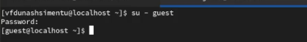
Создал программу simpleid.c:
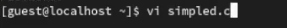
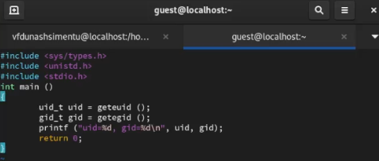

Скомпилировал программу и убедитесь, что файл программы создан:gcc simpleid.c -o simpleid
Выполнил программу simpleid: ./simpleid и системную программу id:id и сравните полученный вами результат с данными предыдущего пункта задания.

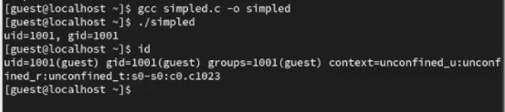

Усложнил программу, добавив вывод действительных идентификаторов:

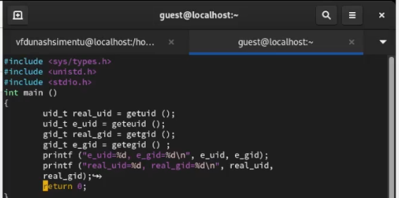
Получившуюся программу назовите simpleid2.c.
Скомпилируйте и запустите simpleid2.c:
  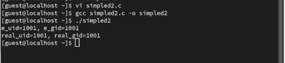

От имени суперпользователя выполните команды

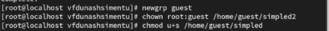

Используйте sudo или повысьте временно свои права с помощью su.
Поясните, что делают эти команды.
Выполните проверку правильности установки новых атрибутов и смены владельца файла simpleid2:

владельца файла simpleid2:
  ls -l simpleid2
Запустите simpleid2 и id:
  ./simpleid2
  id
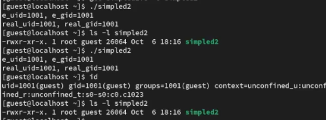
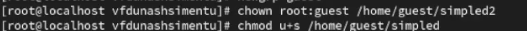

Проделал тоже самое относительно SetGID-бита

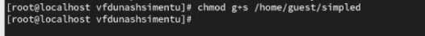
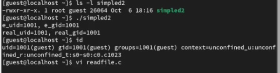

Создайте программу readfile.c:

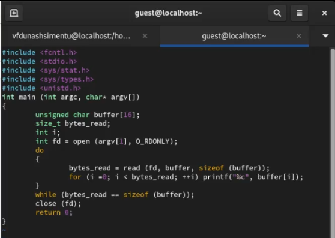
Откомпилирувал её.

Смените владельца у файла readfile.c (или любого другого текстового файла в системе) и измените права так, чтобы только суперпользователь (root) мог прочитать его, a guest не мог.
Проверьте, что пользователь guest не может прочитать файл readfile.c.
Смените у программы readfile владельца и установите SetU’D-бит.
Проверьте, может ли программа readfile прочитать файл readfile.c?
Проверьте, может ли программа readfile прочитать файл /etc/shadow?
Отразите полученный результат и ваши объяснения в отчёте.

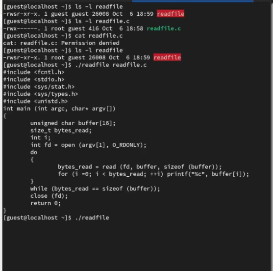
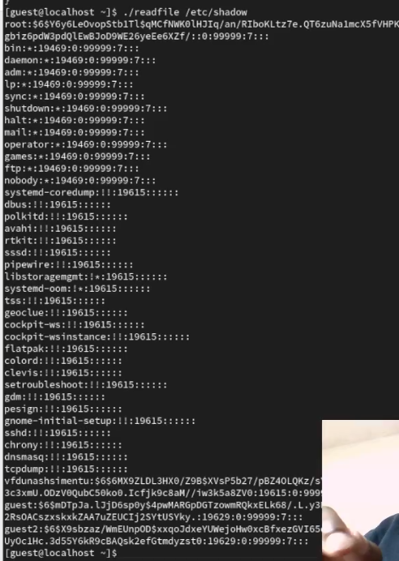

### 5.3.2. Исследование Sticky-бита

Выясните, установлен ли атрибут Sticky на директории /tmp, для чего
выполните команду
ls -l / | grep tmp
2. От имени пользователя guest создайте файл file01.txt в директории /tmp со словом test:
  echo "test" > /tmp/file01.txt
Просмотрите атрибуты у только что созданного файла и разрешите чтение и запись для категории пользователей «все остальные»:
  ls -l /tmp/file01.txt
  chmod o+rw /tmp/file01.txt
  ls -l /tmp/file01.txt
От пользователя guest2 (не являющегося владельцем) попробуйте прочитать файл /tmp/file01.txt:
  cat /tmp/file01.txt
От пользователя guest2 попробуйте дозаписать в файл
/tmp/file01.txt слово test2 командой
  echo "test2" > /tmp/file01.txt
Не Удалось выполнить операцию.
Проверил содержимое файла командой
  cat /tmp/file01.txt
От пользователя guest2 попробуйте записать в файл /tmp/file01.txt слово test3, стерев при этом всю имеющуюся в файле информацию командой
  echo "test3" > /tmp/file01.txt
Не Удалось выполнить операцию.
Проверьте содержимое файла командой cat /tmp/file01.txt
От пользователя guest2 попробуйте удалить файл /tmp/file01.txt командой
  rm /tmp/fileOl.txt
не Удалось удалить файл.
Повысьте свои права до суперпользователя следующей командой
  su -
и выполните после этого команду, снимающую атрибут t (Sticky-бит) с директории /tmp:
  chmod -t /tmp
Покиньте режим суперпользователя командой
  exit
От пользователя guest2 проверьте, что атрибута t у директории /tmp нет:
ls -l / | grep tmp
Повторил предыдущие шаги и не измененил.
Не Удалось удалить файл от имени пользователя, не являющегося его владельцем.
Повысьте свои права до суперпользователя и верните атрибут t на директорию /tmp:
su -
chmod +t /tmp
exit

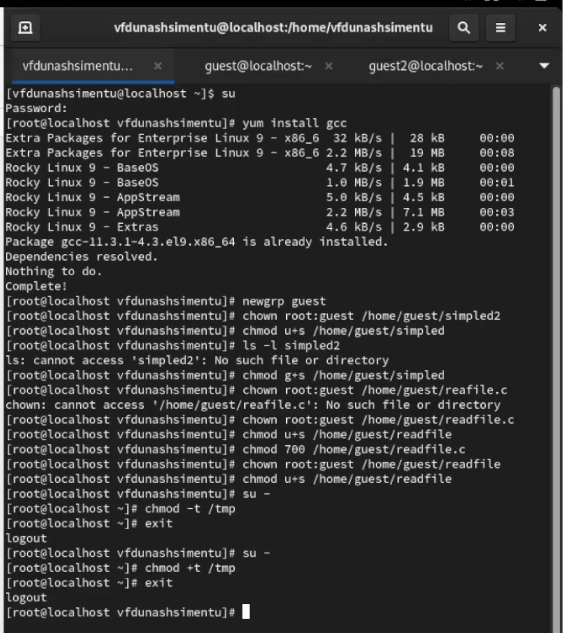
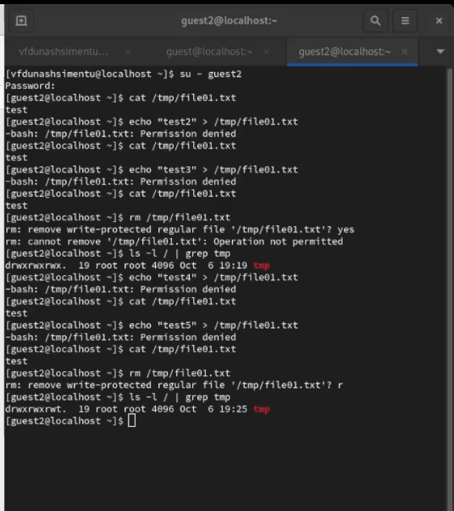

## Выводы

Компилятор GCC-отличный и бесплатный способ компиляции кода на языке C / C++.
