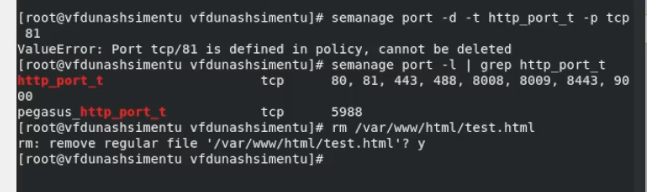

---
## Front matter
title: "Отчёт по лабораторной работе 6"
sub-title: "Мандатное разграничение прав в Linux"
author: "Ду нашсименту Висенте Феликс"

## Generic otions
lang: ru-RU
toc-title: "Содержание"

## Bibliography
bibliography: bib/cite.bib
csl: pandoc/csl/gost-r-7-0-5-2008-numeric.csl

## Pdf output format
toc: true # Table of contents
toc-depth: 2
lof: true # List of figures
lot: true # List of tables
fontsize: 12pt
linestretch: 1.5
papersize: a4
documentclass: scrreprt
## I18n polyglossia
polyglossia-lang:
  name: russian
  options:
	
	- babelshorthands=true
polyglossia-otherlangs:
  name: english
## I18n babel
babel-lang: russian
babel-otherlangs: english
## Fonts
mainfont: PT Serif
romanfont: PT Serif
sansfont: PT Sans
monofont: PT Mono
mainfontoptions: Ligatures=TeX
romanfontoptions: Ligatures=TeX
sansfontoptions: Ligatures=TeX,Scale=MatchLowercase
monofontoptions: Scale=MatchLowercase,Scale=0.9
## Biblatex
biblatex: true
biblio-style: "gost-numeric"
biblatexoptions:
  - parentracker=true
  - backend=biber
  - hyperref=auto
  - language=auto
  - autolang=other*
  - citestyle=gost-numeric
## Pandoc-crossref LaTeX customization
figureTitle: "Рис."
tableTitle: "Таблица"
listingTitle: "Листинг"
lofTitle: "Список иллюстраций"
lotTitle: "Список таблиц"
lolTitle: "Листинги"
## Misc options
indent: true
header-includes:
  - \usepackage{indentfirst}
  - \usepackage{float} # keep figures where there are in the text
  - \floatplacement{figure}{H} # keep figures where there are in the text
---

## 6.1. Цель работы

Развить навыки администрирования ОС Linux. Получить первое практическое знакомство с технологией SELinux1.
Проверить работу SELinx на практике совместно с веб-сервером Apache.

## 6.2. Порядок выполнения работы

1. Вошел в систему с полученными учётными данными и убедитесь, что
SELinux работает в режиме enforcing политики targeted с помощью команд getenforce и sestatus.
2. Обратил с помощью браузера к веб-серверу, запущенному на вашем
компьютере, и убедитесь, что последний работает:
service httpd status или /etc/rc.d/init.d/httpd status
Если не работает, запустите его так же, но с параметром start.

3. Нашёл веб-сервер Apache в списке процессов, определил его контекст безопасности и занесите эту информацию в отчёт. Например, можно использовать команду ps auxZ | grep httpd или ps -eZ | grep httpd.
4. Посмотрил текущее состояние переключателей SELinux для Apache с помощью команды sestatus -bigrep httpd Обратите внимание, что многие из них находятся в положении «off»

5. Посмотрите статистику по политике с помощью команды seinfo, также определите множество пользователей, ролей, типов.
6. Определите тип файлов и поддиректорий,находящихся в директории /var/www, с помощью команды ls -lZ /var/www

7. Определите тип файлов, находящихся в директории /var/www/html:
  ls -lZ /var/www/html

8. Создал от имени суперпользователя (так как в дистрибутиве после установки только ему разрешена запись в директорию) html-файл /var/www/html/test.html следующего содержания:

9. Проверил контекст созданного вами файла. Занесите в отчёт контекст, присваиваемый по умолчанию вновь созданным файлам в директории /var/www/html.

10.  Обратил к файлу через веб-сервер, введя в браузере адрес http://127.0.0.1/test.html. Убедил, что файл был успешно отображён.

12. Изучил справку man httpd_selinux и выяснил, какие контексты файлов определены для httpd. Сопоставьте их с типом файла test.html. Проверил контекст файла можно командой ls -Z.
ls -Z /var/www/html/test.html
Рассмотрил полученный контекст детально. Обратите внимание, что так как по умолчанию пользователи CentOS являются свободными от типа (unconfined в переводе с англ. означает свободный), созданному нами файлу test.html был сопоставлен SELinux, пользователь unconfined_u.
Это первая часть контекста.
Далее политика ролевого разделения доступа RBAC используется процессами, но не файлами, поэтому роли не имеют никакого значения для файлов. Роль object_r используется по умолчанию для файлов на «постоянных» носителях и на сетевых файловых системах. (В директории /ргос файлы, относящиеся к процессам, могут иметь роль system_r.
Если активна политика MLS, то могут использоваться и другие роли, например, secadm_r. Данный случай мы рассматривать не будем, как и предназначение :s0).
Тип httpd_sys_content_t позволяет процессу httpd получить доступ к файлу. Благодаря наличию последнего типа мы получили доступ к файлу при обращении к нему через браузер.
13. Измените контекст файла /var/www/html/test.html с httpd_sys_content_t на любой другой, к которому процесс httpd не
должен иметь доступа, например, на samba_share_t:
chcon -t samba_share_t /var/www/html/test.html
ls -Z /var/www/html/test.html

14. Попробуйте ещё раз получить доступ к файлу через веб-сервер, введя в
браузере адрес http://127.0.0.1/test.html. Я получил сообщение об ошибке:
  Forbidden
    You don't have permission to access /test.html on this server.

16. Попробувал запустить веб-сервер Apache на прослушивание ТСР-порта 81 (а не 80, как рекомендует IANA и прописано в /etc/services). Для
этого в файле /etc/httpd/httpd.conf найдите строчку Listen 80 и замените её на Listen 81.

17.   Выполните команду
semanage port -a -t http_port_t -р tcp 81
После этого проверьте список портов командой
semanage port -l | grep http_port_t
Убедитесь, что порт 81 появился в списке.

18. Вернул контекст httpd_sys_cоntent__t к файлу /var/www/html/ test.html:
chcon -t httpd_sys_content_t /var/www/html/test.html
После этого попробуйте получить доступ к файлу через веб-сервер, введя в браузере адрес http://127.0.0.1:81/test.html.

19. Исправил обратно конфигурационный файл apache, вернув Listen 80.

20. Удалите привязку http_port_t к 81 порту:
semanage port -d -t http_port_t -p tcp 81
и проверьте, что порт 81 удалён.
21. Удалите файл /var/www/html/test.html:
rm /var/www/html/test.html

## Выводы

SELinux предоставляет надежную и гибкую платформу для обеспечения соблюдения политик безопасности контроля доступа.