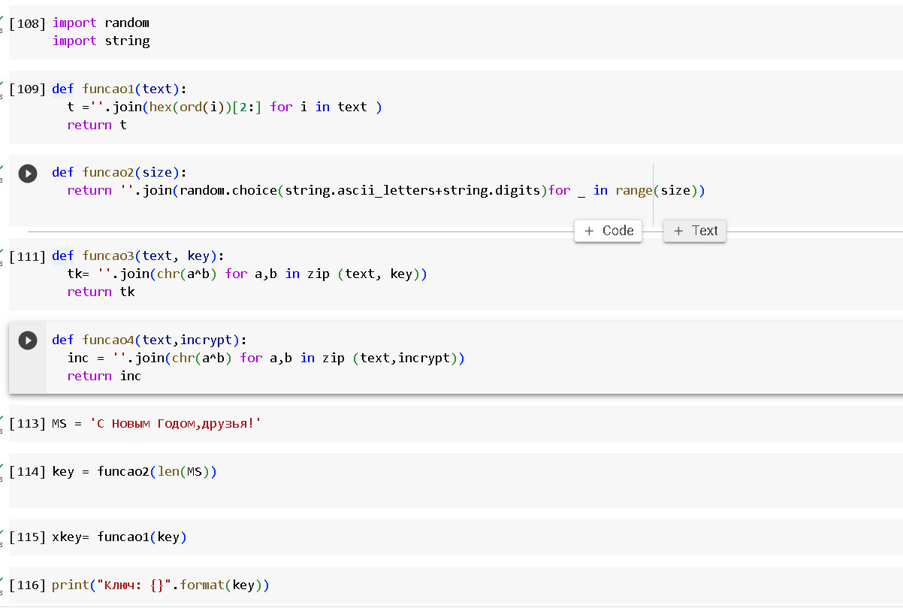
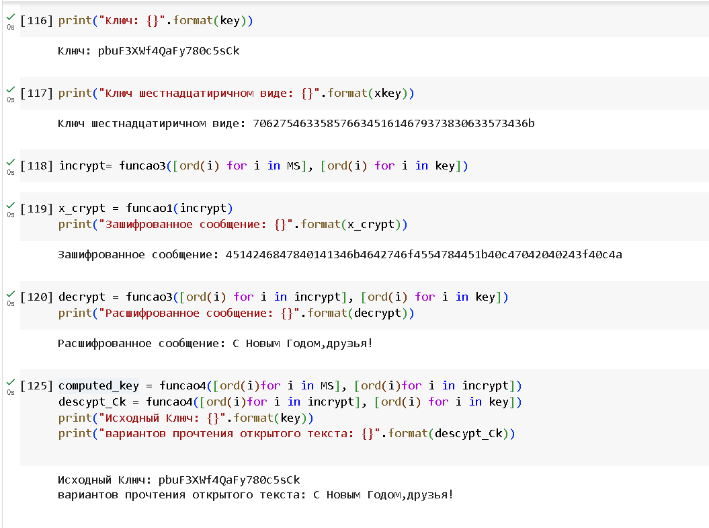

---
## Front matter
lang: ru-RU
title: Лабораторная работа №3
subtitle: Информационная безопасность
author:
  - Ду Нашсименту В.Ф.ж.
institute:
  - Российский университет дружбы народов, Москва, Россия
date: 14.10.2023

## i18n babel
babel-lang: russian
babel-otherlangs: english

## Formatting pdf
toc: false
toc-title: Содержание
slide_level: 2
aspectratio: 169
section-titles: true
theme: metropolis
header-includes:
 - \metroset{progressbar=frametitle,sectionpage=progressbar,numbering=fraction}
 - '\makeatletter'
 - '\beamer@ignorenonframefalse'
 - '\makeatother'
 - \usepackage{amsmath}
---

## Докладчик

:::::::::::::: {.columns align=center}
::: {.column width="70%"}

* Ду Нашсименту Висенте феликс Жозе
* студент группы НКНбд-01-20
* Факультет физико-математических и естественных наук
* Российский университет дружбы народов
* <https://github.com/kpatocfelix>

:::
::::::::::::::

## Цель работы

Развить навыки администрирования ОС Linux. Получить первое практическое знакомство с технологией
SELinux1. Проверить работу SELinx на практике совместно с веб-сервером Apache.

****

## Выполнение лабораторной работы

## Что такое SELinux?

Security-Enhanced Linux (SELinux) - это архитектура безопасности для систем Linux®, которая позволяет администраторам иметь больший контроль над тем, кто может получить доступ к системе. Первоначально он был разработан Агентством национальной безопасности США (АНБ) как серия исправлений для ядра Linux с использованием модулей безопасности Linux (LSM).

Как работает SELinux?
SELinux определяет элементы управления доступом для приложений, процессов и файлов системы. Он использует политики безопасности, набор правил, которые сообщают SELinux, к чему можно или нельзя получить доступ, для обеспечения доступа, разрешенного данной политикой. 

Когда приложение или процесс, также известный как сущность, запрашивает доступ к объекту, например к файлу, SELinux выполняет проверку с помощью кэша вектора доступа (AVC), где хранятся разрешения для сущностей и объектов.

Если SELinux не может принять решение о доступе на основе кэшированных разрешений, он отправит запрос на сервер безопасности. Этот сервер проверяет контекст безопасности объекта и файл.

### HTTPD

httpd - это сокращение от "Hypertext Transfer Protocol Daemon" или просто веб-сервер Apache. В мире Linux и других UNIX-подобных операционных систем, httpd обычно используется для обозначения процесса или службы, отвечающей за обслуживание HTTP-запросов.

Когда вы видите упоминание httpd, это означает, что речь идет о веб-сервере Apache. Apache является одним из самых популярных веб-серверов в мире и широко используется для хостинга веб-сайтов и обслуживания веб-приложений. Он поддерживает множество операционных систем, включая Linux. Apache предоставляет множество функций и настроек, делая его очень гибким для различных веб-приложений.

### Основные характеристики веб-сервера Apache(httpd)

1. Модульность:
Apache является модульным сервером, что позволяет администраторам включать или выключать определенные функции через динамически загружаемые модули. Эта модульность повышает производительность и позволяет настраивать сервер под конкретные потребности.
2. Виртуальное Хостинг:
Apache поддерживает виртуальный хостинг, что позволяет размещать несколько веб-сайтов на одном сервере. Эта возможность позволяет хостить различные домены и поддомены на одном сервере.
3. Безопасность:
Поддержка SSL/TLS: Apache обеспечивает надежную поддержку зашифрованных соединений через протоколы SSL/TLS. Это необходимо для защиты конфиденциальных данных, передаваемых по сети.
Аутентификация и Авторизация: Apache поддерживает различные методы аутентификации, включая базовую, дайджест-аутентификацию и аутентификацию через LDAP. Кроме того, он предоставляет возможность точного управления доступом через файлы .htaccess, позволяя устанавливать ограничения на уровне директорий.
4. Логирование и Мониторинг:
Комплексное Логирование: Apache предоставляет детализированные возможности логирования, позволяя администраторам отслеживать активность сервера, отлавливать ошибки и анализировать паттерны трафика.
Контроль Доступа и Ограничения: Apache может ограничивать доступ на основе IP-адресов, доменных имен и других характеристик запросов. Также он может устанавливать ограничения на полосу пропускания и предотвращать прямые ссылки на файлы на сервере (hotlinking).
5. Реврайтинг и Редирект:
Реврайтинг URL: Модуль mod_rewrite в Apache позволяет осуществлять сложные манипуляции с URL. Он поддерживает создание URL, дружелюбных к поисковым системам, редиректы запросов и изменение параметров запросов.
Редирект: Apache может обрабатывать редиректы (301, 302 и др.), что позволяет администраторам перенаправлять трафик с одного URL на другой.
6. Проксирование и Балансировка Нагрузки:
Обратный Прокси: Apache может действовать как обратный прокси, перенаправляя запросы на бэкэнд-серверы. Это полезно для балансировки нагрузки, кэширования и улучшения безопасности.
Балансировка Нагрузки: Apache поддерживает балансировку нагрузки между несколькими бэкэнд-серверами, равномерно распределяя входящие запросы для эффективного управления нагрузкой.
7. Поддержка Динамического Контента:
Поддержка CGI: Apache поддерживает скрипты Common Gateway Interface (CGI), позволяя выполнение динамических скриптов на сервере.
Скрипты на Сервере: Apache поддерживает скриптовые языки на стороне сервера, такие как PHP, Python и Perl, что позволяет создавать динамический веб-контент.
8. Обширная Документация и Поддержка Сообщества:
Apache HTTP Server обладает обширной документацией и большим сообществом пользователей и разработчиков. Этот богатый источник информации упрощает устранение ошибок, настройку и оптимизацию.
9. Кроссплатформенная Совместимость:
Apache кроссплатформенный и работает на различных операционных системах, включая Linux, Unix, Windows и macOS.

Эти характеристики делают Apache HTTP Server популярным выбором для хостинга веб-сайтов и подтверждают его гибкость, надежность и возможности в обеспечении безопасности.

## Выводы

SELinux предоставляет надежную и гибкую платформу для обеспечения соблюдения политик безопасности контроля доступа.