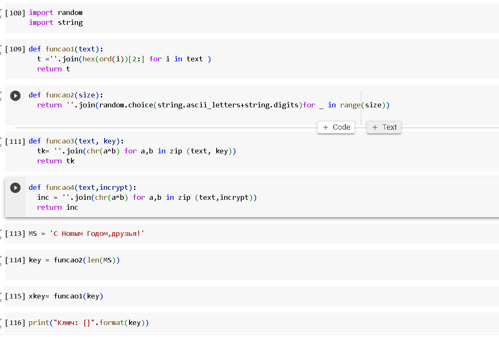
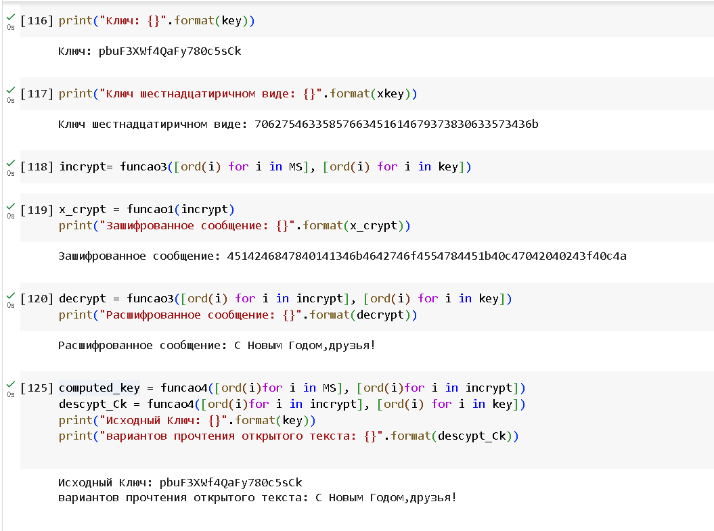

---
## Front matter
title: "Отчёт по лабораторной работе 7"
sub-title: "Элементы
криптографии. Однократное гаммирование"
author: "Ду нашсименту Висенте Феликс"

## Formatting pdf
toc: false
toc-title: Содержание
slide_level: 2
aspectratio: 169
section-titles: true
theme: metropolis
header-includes:
 - \metroset{progressbar=frametitle,sectionpage=progressbar,numbering=fraction}
 - '\makeatletter'
 - '\beamer@ignorenonframefalse'
 - '\makeatother'
 - \usepackage{amsmath}

---
<h1 style="text-align: center;"> РОССИЙСКИЙ УНИВЕРСИТЕТ ДРУЖБЫ НАРОДОВ </h1>

<h2 style="text-align: center;">Факультет физико-математических и естественных наук </h2> 

 
 
 
 
 
 

<h2 style="text-align: center;"> Кафедра информационных технологий </h2>
<h3 style="text-align: center;"> Дисциплина: Информационная безопасность </h3>
 
 
 
 
 
 
 
 
 
 
 
 
 
 
 
 

##### Студент:  Ду Нашсименту Висенте Феликс Жозе
##### Группа:   НкНбд01-20

Москва 2023 

***

 
\pagebreak 

## 7.1. Цель работы

Освоить на практике применение режима однократного гаммирования

## 7.2. Порядок выполнения работы

 у Меня есть скрипт на языке Python, который выполняет шифрование и дешифрование для заданного сообщения MS. Скрипт использует случайно сгенерированный ключ, выполняет побитовые операции XOR на ASCII-значениях символов и затем выводит зашифрованное сообщение, а также расшифрованное сообщение. Кроме того, скрипт вычисляет исходный ключ, выполняя XOR-операции над зашифрованным сообщением и зашифрованным ключом.

Давайте пройдемся по коду и предоставим краткое описание:

1) funcao1(text):

* Преобразует символы входного текста в их шестнадцатеричное представление.
* Используется для отображения ключа и зашифрованного сообщения в шестнадцатеричном формате.

2) funcao2(size):

* Генерирует случайный ключ указанного размера, состоящий из заглавных букв и цифр.
* Используется в качестве ключа шифрования.

3) funcao3(text, key):

* Выполняет побитовую операцию XOR над ASCII-значениями символов во входном тексте и ключе.
* Используется как для шифрования, так и для дешифрования.

4) funcao4(text, incrypt):

* Аналогично funcao3, выполняет операцию XOR, но на этот раз используется для вычисления исходного ключа из зашифрованного сообщения и зашифрованного ключа.

Вот краткое описание выполнения скрипта:

* Исходное сообщение: "С Новым Годом,друзья!"
Генерируется случайный ключ с помощью funcao2.
* Ключ преобразуется в шестнадцатеричный формат с использованием funcao1.
* Исходное сообщение шифруется с использованием сгенерированного ключа и выводится в шестнадцатеричном формате.
* Зашифрованное сообщение расшифровывается обратно с использованием того же ключа и выводится.
* Исходный ключ вычисляется из зашифрованного сообщения и зашифрованного ключа.
* Исходный ключ и вариант расшифрованного сообщения (вычисленный из зашифрованного сообщения и вычисленного ключа) выводятся на экран.

## Выводы

Этот код выполняет простую форму шифрования XOR. Это базовая демонстрация XOR-шифрования и не должен использоваться для безопасных коммуникационных целей. Кроме того, код предполагает, что входное сообщение и ключ находятся в той же кодировке символов. Если это не так, результаты могут не соответствовать ожиданиям.
