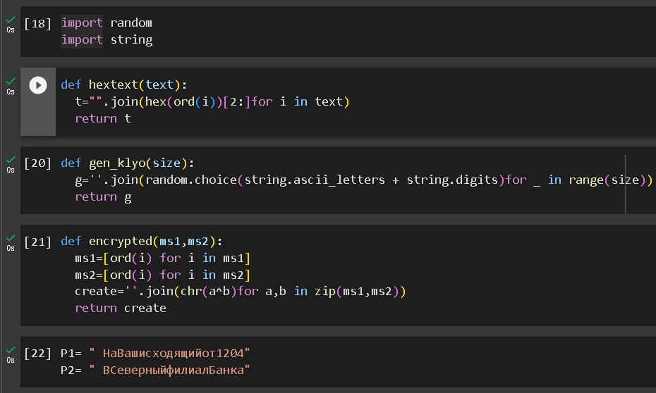
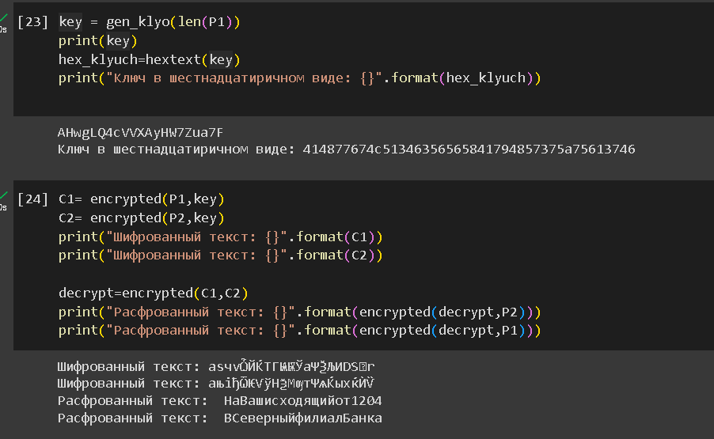

---
## Front matter
title: "Отчёт по лабораторной работе 8"
sub-title: "Элементы
криптографии. Однократное гаммирование"
author: "Ду нашсименту Висенте Феликс"

## Generic otions
lang: ru-RU
toc-title: "Содержание"

## Bibliography
bibliography: bib/cite.bib
csl: pandoc/csl/gost-r-7-0-5-2008-numeric.csl

## Pdf output format
toc: true # Table of contents
toc-depth: 2
lof: true # List of figures
lot: true # List of tables
fontsize: 12pt
linestretch: 1.5
papersize: a4
documentclass: scrreprt
## I18n polyglossia
polyglossia-lang:
  name: russian
  options:
	
	- babelshorthands=true
polyglossia-otherlangs:
  name: english
## I18n babel
babel-lang: russian
babel-otherlangs: english
## Fonts
mainfont: PT Serif
romanfont: PT Serif
sansfont: PT Sans
monofont: PT Mono
mainfontoptions: Ligatures=TeX
romanfontoptions: Ligatures=TeX
sansfontoptions: Ligatures=TeX,Scale=MatchLowercase
monofontoptions: Scale=MatchLowercase,Scale=0.9
## Biblatex
biblatex: true
biblio-style: "gost-numeric"
biblatexoptions:
  - parentracker=true
  - backend=biber
  - hyperref=auto
  - language=auto
  - autolang=other*
  - citestyle=gost-numeric
## Pandoc-crossref LaTeX customization
figureTitle: "Рис."
tableTitle: "Таблица"
listingTitle: "Листинг"
lofTitle: "Список иллюстраций"
lotTitle: "Список таблиц"
lolTitle: "Листинги"
## Misc options
indent: true
header-includes:
  - \usepackage{indentfirst}
  - \usepackage{float} # keep figures where there are in the text
  - \floatplacement{figure}{H} # keep figures where there are in the text
---

## 8.1. Цель работы

Освоить на практике применение режима однократного гаммирования
на примере кодирования различных исходных текстов одним ключом

## 8.2. Порядок выполнения работы

Я создал программу на Python для шифрования и расшифровки текста, используя операцию XOR с случайно сгенерированным ключом. Позвольте объяснить, как работает Мой код шаг за шагом:

Функция hextext(text):

Эта функция принимает строку text в качестве входных данных.
Каждый символ во входной строке преобразуется в его соответствующее значение ASCII, а затем значение ASCII преобразуется в его шестнадцатеричное представление.
Результатом является строка шестнадцатеричных значений, представляющих входной текст.
Функция gen_klyo(size):

Эта функция генерирует случайную строку указанного размера size, используя буквы (как заглавные, так и строчные) и цифры.
Сгенерированная строка служит в качестве ключа шифрования.
Функция encrypted(ms1, ms2):

Эта функция принимает две входные строки ms1 и ms2.
Каждый символ в обеих входных строках преобразуется в его значение ASCII.
Производится операция XOR между соответствующими значениями ASCII символов из ms1 и ms2.
Результат XOR затем снова преобразуется в символ с использованием функции chr().
Функция возвращает строку, представляющую зашифрованное сообщение.
В вашем коде вы шифруете два сообщения (P1 и P2) с использованием случайно сгенерированного ключа, а затем расшифровываете их, чтобы получить исходные сообщения.

 
\pagebreak 

## Выводы

Этот код выполняет простую форму шифрования XOR. Это базовая демонстрация XOR-шифрования и не должен использоваться для безопасных коммуникационных целей. Кроме того, код предполагает, что входное сообщение и ключ находятся в той же кодировке символов. Если это не так, результаты могут не соответствовать ожиданиям.
